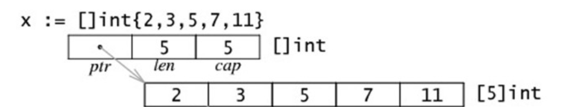
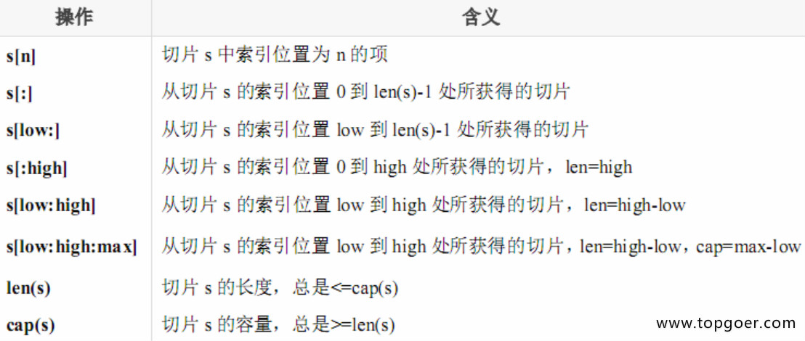

`@authon:aslanwang`
`@time:2022-3-7`

# 关于go语言的主要特征
## 可见性
* 声明在函数内部，是函数的本地值，类似`private`
* 声明在函数外部，则对当前包可见(包内所有`.go`文件都可见)的全局值，类似`protect`
* 声明在函数外部且**首字母大写**是所有包可见的全局值，类似`public`
## 内置类型
* 固定大小的数组`array`在`go`中是**值类型**
* `slice, map, chan`都是引用类型
* `init`函数：
    * init函数是用于程序执行前做包的初始化的函数，比如初始化包里的变量等
    * 每个包可以拥有多个`init`函数，包的每个源文件也可以拥有多个`init`函数
    *  同一个包中多个`init`函数的执行顺序`go`语言没有明确的说明
    * 不同包的`init`函数按照包导入的依赖关系决定该初始化函数的执行顺序 
    * `init`函数不能被其他函数调用，而是在`main`函数执行之前，自动被调用
* `init`函数的调用顺序：
    * 对同一个`go`文件的`init()`调用顺序是从上到下的
    * 对同一个`package`中不同文件是按文件名字符串比较“从小到大”顺序调用各文件中的`init()`函数。
    * 对于不同的`package`，如果不相互依赖的话，按照`main`包中"先`import`的后调用"的顺序调用其包中的`init()`，如果`package`存在依赖，则先调用最早被依赖的`package`中的`init()`，最后调用`main`函数。
## 下划线
* 下划线在`import _包路径`中：当`import`一个包时，该包的所有`init`函数都会被执行，如果引入这个包就是为了执行`init`函数，而不需要引入该包内的其它函数，则我们可以以`import  _包路径`的方式引入这个包
* 下划线在代码中：占位符，用于忽略某个变量如` f, _ := os.Open("/Users/Desktop/text.txt")`
## 变量声明
* 标准声明：`var name type`
* 批量声明：
`var ( `
                `name1 type1`
                `name2 type2`
                ...
        `)`
 * 变量初始化：`var name type = expression`，`var name1,name2 = expr1,expr2`，或通过类型推导，根据初始值自动推导变量类型：`var name = expr`
 * 函数内部的短变量声明：函数内部可以使用`name := expr`声明变量
 * 匿名变量：即将变量赋值给`_`
 * **函数外的每个语句都必须以关键字开始（var、const、func等）**
## 常量
*常量只是将变量声明中的`var`换为`const`即可，另外当同时声明多个常量时，如果省略了`value`则表明与上一行的值相同，如
`const(`
        `n1 = 100`
        `n2`
        `n3`
        `)` ，这里`n1,n2,n3`的值都是`100`
## itoa
* `iota`是`go`语言的常量计数器，只能在常量的表达式中使用： `iota`在`const`关键字出现时将被重置为`0`，`const`中每新增一行常量声明将使`iota`计数一次(`iota`可理解为`const`语句块中的行索引)，使用它能简化定义，在定义枚举时很有用，如：
    * `const (`
            `n1 = iota //0`
            `n2        //1`
            `n3        //2`
            `n4        //3`
        `)`
    *使用`_`跳过某些值：
        `const (`
            `n1 = iota //0`
            `n2        //1`
            `_           `
            `n4          //3`
        `)`
    * `iota`声明中间插队：
        `const (`
            `n1 = iota //0`
            `n2 = 100 //100`
            `n3 = itoa    //2           `
            `n4          //3`
        `)`
    * 定义数量级，`1<<10`表示将`1`的二进制表示向左移`10`位，也就是`1024`。同理`2<<2`表示将2的二进制表示向左移2位，也就是`8`：
        `const (`
            `_  = iota                        // 0被忽略`
            `KB = 1 << (10 * iota)`
            `MB = 1 << (10 * iota)`
            `GB = 1 << (10 * iota)`
            `TB = 1 << (10 * iota)`
            `PB = 1 << (10 * iota)`
        `)`
    * 多个`iota`定义在一行：
      `const (`
            `a, b = iota + 1, iota + 2 //1,2`
            `c, d                      //2,3`
            `e, f                      //3,4`
        `)`
## 基本类型
 * 布尔值，`bool`数据只有`true`和`false`两个值：
    *  布尔类型变量的默认值为`false`。
    *  `Go`语言中不允许将整型强制转换为布尔型.
    * 布尔型无法参与数值运算，也无法与其他类型进行转换。
* 字符串：`Go`语言中的字符串以原生数据类型出现，使用字符串就像使用其他原生数据类型（`int、bool、float32、float64`等）一样。`Go`语言里的字符串的内部实现使用`UTF-8`编码，字符串的值为双引号(")中的内容，可以在`Go`语言的源码中直接添加非`ASCII`码字符，例如：`s2 := "你好"`
    * 多行字符串：必须使用\`来定义，如
    **s1 := \`第一行
                第二行
                第三行
    \`**，反引号间换行将被作为字符串中的换行，但是所有的转义字符均无效，文本将会原样输出。
* `byte，rune`：`Go`语言的字符有以下两种：
    * `uint8`类型，或者叫`byte`型，代表了`ASCII`码的一个字符。
    * `rune`类型，实际是`int32`，代表一个`UTF-8`字符，用来处理字符串中出现的`unicode`
    * 字符串底层是一个`byte`数组，所以可以和`[]byte`类型相互转换，但是字符串是不能修改的，它由`byte`字节组成，所以字符串的长度是`byte`字节的长度，但不一定是字符的个数，因为`rune`类型用来表示`utf8`字符，一个`rune`字符由一个或多个`byte`组成，如
```   
   s := "pprof.cn博客"
   fmt.Println(len(s))           // 14个byte
   for i := 0; i < len(s); i++ { // s[i]是byte
   	fmt.Printf("%v(%c) ", s[i], s[i])
   }
   fmt.Println()
   for _, r := range s { // 直接遍历s中的每个字符 所以r是rune
   	fmt.Printf("%v(%c) ", r, r)
   }
   fmt.Println()
} 
```
* 修改字符串：前文已经提到，字符串是不可以被修改的，因此要修改字符串必须先将其转换为`[]rune/[]byte`，**无论哪种转换，都会重新分配内存，并复制字节数组。**
* 类型转换：`go`只支持强制类型转换，`Type(expr)`
## 数组Array
* 数组定义：`var a [len]int`，比如：`var a [5]int`，数组长度必须是常量，且是类型的组成部分，因此`var a[5] int`和`var a[10]int`是不同的类型。
* 数组是值类型，赋值和传参会复制整个数组，而不是指针。
* 数组支持 `==、!=` 操作符，因为内存总是被初始化过的。
* 指针的数组 `[n]*T`，数组的指针`*[n]T`。
## 切片Slice
* `slice`的内存布局：

    * 切片是数组的一个引用，因此切片是引用类型。但**切片自身是结构体，值拷贝传递**。    
    * 切片是一个可变的数组。
    * 切片遍历方式和数组一样，可以用`len()`求长度。表示可用元素数量，读写操作不能超过该限制。
    * `cap`可以求出`slice`最大扩张容量，不能超出数组限制：`0 <= len(slice) <= len(array)`，其中`array`是`slice`引用的数组。
    * 如果`slice == nil`，那么`len、cap`结果都等于`0`
* `nil`切片与空切片：两者的`len, cap`结果都为`0`，唯一能够区分它们的就是`slice == nil`：
    * 一个只有声明的切片是`nil`切片，即`var buf []byte`则`buf`是`nil`切片；而`buf := []byte{}`，`buf`则是`empty`切片    
* 常见切分操作：对`slice/array`做以下切分操作返回的都是`slice`

* `copy`：`copy(target, source)`，在两个`slice`间复制数据，复制长度以`len`小的为准。两个`slice`可指向同一底层数组，允许元素区间重叠。
* **切分返回的依然是对原数组的引用**：
```
func splitSlice() {
	var a = []byte{0, 1, 2, 3, 4, 5, 6, 7, 8, 9} // byte数组[0,...9]
	b := a[0:2]                                  // 引用上面的数组 len=2 cap = 10 即原数组的cap
	c := a[1:2]                                  // 引用数组第一个元素的地址为起始地址 len=1 cap=9 即原数组的cap-1
	fmt.Printf("%p\t%v\n", a, a)
	fmt.Printf("%p\t%v\n", b, b)
	fmt.Printf("%p\t%v\n", c, c)
	fmt.Println(len(a), cap(a))
	fmt.Println(len(b), cap(b))
	fmt.Println(len(c), cap(c))
}
```
* 字符串切片：`string`底层就是一个`byte`的数组，因此，也可以进行切片操作：
    * 对英文字符串，直接将`string`转为`[]byte`即可切片；对中文字符串则需要转为`[]rune`
## Slice的底层实现
* 扩容策略：
    * 如果切片的容量小于`1024`个元素，于是扩容的时候就翻倍增加容量。一旦元素个数超过`1024`个元素，那么增长因子就变成`1.25`。
    * 对切片`src`，进行切分得到`dst`，恰如前文所述，这两者引用同一个数组，那么向`dst`中附加元素时，若该数组的`cap`仍然足够，则不会引起空间的分配，而是直接在该原数组中修改，这时就会影响到`src`，很容易出`bug`
* 对切片进行`for index, value = range slice`得到的`value`实际上是切片中值的拷贝。
## 指针
* `Go`语言中的指针不能进行偏移和运算，是安全指针
## map
* `go`语言中的`map`是一种无序的基于`key-value`的数据结构，`map`是引用类型，必须初始化才能使用。
* 按照指定顺序遍历`map`
    * 即将所有的`key`先排列成指定顺序，如排序，然后再去`forr map`
* `[]map[string][int]`：值为`map[string][int]`类型的切片
* `map[string][]int`：值为切片`[]int`，`key`为`string`类型的`map`
    * `map [string][int]{"张三": 18, "李四": 27}`
## map实现原理
* `Map`是一种通过`key`来获取`value`的数据结构，其底层存储方式为数组，在存储时`key`不能重复，否则`value`进行覆盖，我们对`key`进行`hash`运算（可以简单理解为把`key`转化为一个整形数字）然后对数组的长度取余，就得到`key`存储在数组的哪个下标位置，最后将`key`和`value`组装为一个结构体，放入数组下标处。
* `hash`冲突的处理：一般都是开放定址法：即向`map`中加入一个键值对`(k, v)`时，发现`hashkey(k)`的下标已经占用，则我们在数组空间中重新找一个没被占用的位置来存储这个键值对，找寻这个位置的策略如下：
    * 线性补偿探测法
    * 随机探测法
    * 线性探测法：即对数组空间按照顺序，从冲突的下标处开始依次往后探测，到达数组末尾时，则返回到数组起始处继续探测，直到找到一个空闲的位置存储这个键值对，当数组已经没有空闲位置时进行扩容（事实上，当数组容量快满的时候就会扩容了
    * 拉链法：即当键值对`(k, v)hash`冲突时，就在冲突位置的元素上形成一个链表，通过指针互连接，这样在查找时若发现`k`冲突，则顺着链表一直往下找，直到链表的尾节点，找不到则返回`nil`
* `go`中的`map`就是一个`hash table`，使用拉链法解决`hash`冲突：
    * 详解见[golang-map详解](https://segmentfault.com/a/1190000023879178)
## 结构体
* 类型定义：`type myType Type`，如`type myInt int`
* 类型别名：`type myType = Type`,如`type rune = int32`
* 它们的区别在于：类型定义可以认为是定义出了一种新的类型，用它声明一个变量，则变量就是`myType`类型；而类型别名声明的变量，在编译后就会变成`Type`类型，而不是`myType`。
* `go`中使用`type myType struct`定义一个结构体类型，即`myType`成为一种结构体，我们可以像声明内置类型一样使用`var`关键字定义一个结构体。
    * 匿名结构体：即直接使用`var t struct{field:Type...}`
* 对结构体的指针，`go`语言支持直接使用`指针+.`来访问结构体的成员。
* `one example`：
```
type student struct {
	name string
	age  int
}

func main() {
	m := make(map[string]*student)
	stus := []student{
		{name: "pprof.cn", age: 18},
		{name: "测试", age: 23},
		{name: "博客", age: 28},
	}
	for _, stu := range stus {
		m[stu.name] = &stu
		fmt.Println(m)
	}
	for k, v := range m {
		fmt.Println(k, "=>", v.name)
	}
}
输出结果为： 
    pprof.cn=>博客
    测试=>博客
    博客=>博客
结果分析：这是因为在forr stus时，stu一直是同一个地址，
只不过stu依次被赋值为student[0], student[1],student[2]，
于是在循环结束后mp[k]的v统一指向student[2]
```
* `method & receiver：method`指的是作用于一种特定类型变量`receiver`的函数
    * `method`的声明：`func (r receiver) method(入参列表)(返回值) {
        函数体
    }`其中：
        * `r`为接收者变量：该参数在命名时，建议使用接收者类型名的第一个小写字母，如，`Person`类型的接收者变量应该命名为 `p`。
        * `receiver`即接收者类型：接收者类型和参数类似，可以是指针类型和非指针类型。
        * 方法名`method`、参数列表、返回参数：具体格式与函数定义相同。
    * `method`与`function`的区别是，`function`不属于任何类型，`method`则归属于特定的类型。
    * 指针类型的`receiver`：在`method`中对`r`的修改在`method`退出后都是有效的，这类似于`c++`中的`this`，**对于这种`method`也可以通过值来调用**
    * 值类型的`receiver`：在运行时，`go`会将`r`的值`copy`一份，在`method`中只能修改这个副本，无法修改`r`本身。
    * 注意这里的`receiver`可以是任意本地类型。
* 结构体的匿名字段：结构体允许在声明成员字段时**没有字段名而只有类型**，这种字段就称为匿名字段
    * 匿名字段默认采用类型名作为字段名，而结构体要求字段名称必须唯一，因此一个结构体中同类型的匿名字段只能有一个。
* 嵌套匿名结构体：如
```
type Address struct {
    Province string
    City     string
}

//User 用户结构体
type User struct {
    Name    string
    Gender  string
    Address //匿名结构体
}

func main() {
    var user2 User
    user2.Name = "pprof"
    user2.Gender = "女"
    user2.Address.Province = "黑龙江"    //通过匿名结构体.字段名访问
    user2.City = "哈尔滨"                //直接访问匿名结构体的字段名
    fmt.Printf("user2=%#v\n", user2) //user2=main.User{Name:"pprof", Gender:"女", Address:main.Address{Province:"黑龙江", City:"哈尔滨"}}
}
```
* 当访问结构体成员时会先在结构体中查找该字段，找不到再去匿名结构体中查找；嵌套结构体内部可能存在相同的字段名，这个时候为了避免歧义需要指定具体的内嵌结构体的字段。
* 结构体的“继承”：可以通过在`son`结构体中通过嵌套匿名结构体来实现继承：
```
//Animal 动物
type Animal struct {
    name string
}

func (a *Animal) move() {
    fmt.Printf("%s会动！\n", a.name)
}

//Dog 狗
type Dog struct {
    Feet    int8
    *Animal //通过嵌套匿名结构体实现继承
}

func (d *Dog) wang() {
    fmt.Printf("%s会汪汪汪~\n", d.name)
}

func main() {
    d1 := &Dog{
        Feet: 4,
        Animal: &Animal{ //注意嵌套的是结构体指针
            name: "乐乐",
        },
    }
    d1.wang() //乐乐会汪汪汪~
    d1.move() //乐乐会动！
}
```
* 结构体字段可见性：结构体中字段大写开头表示可公开访问，小写表示私有（仅在定义当前结构体的包中可访问）。
* 结构体`Tag`与`JSON`序列化：
    * `Tag`是结构体的元信息，可以在运行的时候通过反射的机制读取出来，`Tag`在结构体字段的后方定义，由一对反引号包裹起来，具体的格式如下：\`key1:"value1"\`,，如为字段定义`json`序列化的格式\`json:id\`，
    * 对结构体进行`json`序列化时默认使用字段名作为`key`，且结构体的私有字段不能被`json`包访问
## switch
```
switch expr {
    case val1:
            ...
    case val2:
            ...
    default:
            ...
}
```
* 其中，`expr`可以是任意类型，`val1,val2,...`可以为任意值，但必须是同类型的
* **`go`的`switch-case`不需要`break`，如果想测试多个可能符合条件的值，使用`case val1,val2,val3...**
* `Type Switch`：`switch`可以用来判断某个`interface`变量实际存储的变量类型：
```
switch x := i.(type) { 
	case nil:
		fmt.Printf("i 的类型 :%T\r\n", x)
	case int:
		fmt.Printf("i 是 int 型")
	case float64:
		fmt.Printf("i 是 float64 型")
	case func(int) float64:
		fmt.Printf("i 是 func(int) 型")
	case bool, string:
		fmt.Printf("i 是 bool 或 string 型")
	default:
		fmt.Printf("未知型")
	}
```
## select
```
select {
    case communication clause  :
       statement(s);      
    case communication clause  :
       statement(s);
    /* 你可以定义任意数量的 case */
    default : /* 可选 */
       statement(s);
}
```
* `select`类似于用于通信的`switch`语句。每个`case`必须是一个通信操作，要么是发送要么是接收。 `select`随机执行一个可运行的`case`，如果没有`case`可运行，它将阻塞，直到有`case`可运行。一个默认的子句应该总是可运行的。
    * 每个`case`都必须是一个通信
    * 所有`channel`表达式或被发送的表达式都会被求值
    * 如果任意某个通信可以进行，它就执行；其他被忽略。
    * 如果有多个`case`都可以运行，`select`会随机公平地选出一个执行。其他不会执行。
    * 否则：
        * 如果有`default`子句，则执行该语句。
        * 如果没有`default`字句，`select`将阻塞，直到某个通信可以运行；`Go`不会重新对channel或值进行求值。
* 超时判断：
```
// 使用全局resChan来接受response，如果时间超过3s,
// resChan中还没有数据返回，则执行第二条case
var resChan = make(chan int)
// do request
func test() {
    select {
    case data := <-resChan:
        doData(data)
    case <-time.After(time.Second * 3):
        fmt.Println("request time out")
    }
```
* 退出：
```
// 主协程如下：
var shouldQuit=make(chan struct{})
fun main(){
    ...
    select {
        case <-c.shouldQuit:
            cleanUp()
            return
        }
    //...
}

// 在另外一个协程中，如果运行遇到非法操作或不可处理的错误，
// 就向shouldQuit发送数据通知程序停止运行
close(shouldQuit)
```
* 判断`channel`是否阻塞：
```
// 若不希望channel缓存满，可以用如下方法判断
ch := make (chan int, 5)
data：= 0
select {
case ch <- data:
default:
    //做相应操作，比如丢弃data。视需求而定
}
```
## for-range
* 对非引用对象，如数组`arr := [...]int{1,2,3}`，进行`for i,v := range arr`时，会将原数组复制一份，于是`i, v`都基于这个复制品迭代而来，如下：
```
a := [3]int{0, 1, 2}
for i, v := range a { // index、value 都是从复制品中取出
    if i == 0 { // 在修改前，我们先修改原数组
        a[1], a[2] = 999, 999
        fmt.Println(a) // 确认修改有效，输出 [0, 999, 999]
    }
    a[i] = v + 100 // 使用复制品中取出的 value 修改原数组
}
fmt.Println(a) // 输出 [100, 101, 102]
```
* 对引用对象如`slice, map, channel`则不会进行复制
    * `for range`遍历`channel`前必须`close(channel)`
## 函数
* 函数的特点：
    * 无需声明原型，支持不定变参。
    * 支持多返回值，支持对返回值命名。 
    * 支持匿名函数和闭包。
    * **函数也是一种类型，是第一类对象，可作为参数传递也可以赋值给变量**。
    * **不支持嵌套 (nested) 一个包不能有两个名字一样的函数**
    * **不支持重载(overload)** 
    * **不支持默认参数 (default parameter)**
* 可变参数传递：
    * `Go`的可变参数本质上就是slice，一个`func`只能有一个可变参数，且必须作为最后一个形参出现；在传递实参时可以直接传递一个`array/slice…`即可。
        * `func myfunc(args ...int) {}   //0`个或多个参数
        * `func add(a int, args…int) int {}   //1`个或多个参数
        * `func add(a int, b int, args…int) int {}    //2`个或多个参数
    * 任意类型的不定参数：即函数的参数个数、每个参数的类型都不是固定的，要使用`interface`作为不定参数的类型
        * `func myfunc(args ...interface{}) {}`
        * `interface{}`传递任意类型数据是`Go`语言的惯例用法，而且`interface{}`是类型安全的。
* 匿名函数：`go`的匿名函数可赋值给变量、作为结构字段、在 `channel`里传送
```
//-----function variable----
fn := func() { fmt.Println("This is a function variable!") }
fn()

//----function collection----
fns := [](func(x int) int){
	func(x int) int { return x + 1 },
	func(x int) int { return x + 2 },
}
fmt.Println(fns[1](fns[0](100)))
//----function as field
d := struct {
	fn func() string
}{
	fn: func() string { return "This is a function as field" },
}
fmt.Println(d.fn())
//----function used in channel
fc := make(chan func() string, 2)
fc <- func() string { return "Hello" }
fc <- func() string { return "world" }
close(fc)
for v := range fc {
	fmt.Println(v())
}
```
* 闭包：闭包是由函数和与其相关的引用环境组合而成的实体。闭包在运行时可以有多个实例，不同的引用环境和相同的函数组合可以产生不同的实例（即引用函数+对应环境）。
```
func enclosure() func() int {
	i := 0
	fc := func() int {
		i++
		fmt.Println(i)
		return i
	}
	return fc
}

func testEnclosure() {
	a := enclosure()
	b := enclosure()
	a() // 1
	a() // 2
	b() // 1
	b() // 2
}
```
* 这段代码有`2`个特点
    * 函数`fc`嵌套在函数`enclosure`内部，函数`enclosure`返回函数`fc`，这样在执行`a:= enclosure()`后，变量`a`实际上是指向了函数`fc()`，再执行函数`a()`后就会显示`i`的值，第一次为`1`，第二次为`2`，以此类推。 其实，这段代码就创建了一个闭包：因为函数`enclosure()`外的变量`a`引用了函数`enclosure()`内的变量函数`fc()`，就是说：当函数`enclosure()`的内部函数`fc()`被函数`enclosure()`外的一个变量引用的时候，就创建了一个闭包。这个闭包使得在`enclosure()`退出后，其中的局部变量`i`仍然存在，也即由于闭包的存在导致了`GC`机制不会收回`enclosure`所占用的资源。
    * 注意到`a()`跟`b()`  引用的是不同的环境，因此在调用`i++`时修改的不是同一个`i`，换句话说函数`enclosure()`每进入一次，就形成了一个新的环境，对应的闭包中，函数都是同一个函数，环境却是引用不同的环境，这和`a()`和`b()`的调用顺序都是无关的。
* 实际上`enclosure`还可以返回一个匿名函数；`fc`也可以引用`enclosure`的入参（如果有）；`enclosure`也可以返回多个闭包。
## 延迟调用defer
* `defer`的特性：
    * `defer`用于注册延迟调用；
    * 这些调用直到`return`前才被执行，因此可以用来做资源清理。
    * 多个`defer`语句，按先进后出的方式执行,哪怕函数或某个`defer`调用发生错误，这些调用依旧会被执行。
    * `defer`语句中的变量，在`defer`声明时就决定了
* 在按照代码流执行到`defer statement`时，将照常计算函数值和调用的参数并重新保存，但不会调用实际函数。
    * 因此在下面的第二段`for`代码中，闭包函数并未被实际调用，等到真正执行这里的`defer`语句时，`i`已经变成了`4`，所以全部都输出`4`
    * 在第三段`for`代码中，每次循环时`func`调用的实参`i`都被重新保存一份，因此在真正执行`defer`时，会输出`4 3 2 1 0`
```
for i := 0; i < 5; i++ {
	defer fmt.Println(i)    // 4 3 2 1 0
}
for i := 0; i < 5; i++ {
	defer func() {
	    fmt.Println(i)    // 4 4 4 4 4 
	}()
}
for i := 0; i < 5; i++ {
	defer func(v int) {
		fmt.Println(v)   // 4 3 2 1 0    
	}(i)
}
```
* 以下代码同理：在真正执行`defer`语句时，`t`已经变成了`"c"`，所以输出全都是`c closed`；如果想要正确关闭`Test`数组，应该将`defer`语句修改，使得当前的`t`被正确保存一份，修改方式如下：
```
type Test struct {
    name string
}

func (t *Test) Close() {
    fmt.Println(t.name, " closed")
}
func main() {
    ts := []Test{{"a"}, {"b"}, {"c"}}
    for _, t := range ts {
        defer t.Close()    
    }
}
// 修改1：增加Close函数，并把t作为其参数
func Close(t *Test) {
       t.Close()
}
func main() {
    ...
    for _,t := range ts {
        defer Close(t)
    }
}
// 修改2：使用变量保存t
func main() {
    for _,t := range ts {
        t2 := t
        defer t2.Close()
    }
}
```
* 例`2`：
```
func foo(a, b int) (i int, err error) {
    defer fmt.Printf("first defer err %v\n", err)
    defer func(err error) { fmt.Printf("second defer err %v\n", err) }(err)
    defer func() { fmt.Printf("third defer err %v\n", err) }()
    err = errors.New("divided by zero!")
    return
}
// third defer err divided by zero
// second defer err nil
// first defer err nil
```
## 异常处理
* `go`使用`panic`抛出错误，`recover`捕获错误。
*  `panic`是内置函数：
    * 假如函数`F`要通过`panic`抛出错误，则其后的代码（包括`defer`）都不再执行，`panic`之前要执行的`defer`函数列表，按照`defer`的逆序执行
    * 返回函数`F`的调用者`G`，在`G`中，调用函数`F`语句之后的代码不再执行，假如函数`G`中存在要执行的`defer`函数列表，按照`defer`的逆序执行
    * 直到`goroutine`整个退出，并报告错误
* `recover`是内置函数：
    * 用来控制一个`goroutine`的`panicking`行为，捕获`panic`，从而影响应用的行为
    * 一般使用：
        * 在`defer`函数中，通过`recever`来终止一个`goroutine`的`panicking`过程，从而恢复正常代码的执行；**`recover`处理异常后，逻辑并不会恢复到`panic`那个点去，而是跑到`defer`之后的那个点，也就是返回到上层函数**
        * 可以获取通过`panic`传递的`error
* 
```
func panicDemo1() {
	defer func() {
		fmt.Println(recover()) //有效
	}()
	defer recover()              //无效！
	defer fmt.Println(recover()) //无效！
	defer func() {
		func() {
			println("defer inner")
			recover() //无效！
		}()
	}()

	panic("test panic")
}
```
* **`recover`只有在与`panic`同级的`defer func()`内直接调用才会终止错误，否则总是返回 nil，而任何未捕获的错误都会沿调用堆栈由内向外传递**：
```
func panicDemo1() {
	defer func() {
		fmt.Println(recover()) //有效
	}()
	defer recover()              //无效！
	defer fmt.Println(recover()) //无效！
	defer func() {
		func() {
			println("defer inner")
			recover() //无效！
		}()
	}()
	panic("test panic")
}
```
* 上例在`defer`匿名函数中`recover()`有效，也可以如下例：
```
func except() {
    fmt.Println(recover())
}
func test() {
    defer except()
    panic("test panic")
}
```
* 如果需要保护代码段，可将代码块重构成匿名函数以确保后续代码被执行：
```
func test(x, y int) {
    var z int
    func() {
        defer func() {
            if recover() != nil {
                z = 0
            }
        }()
        panic("test panic")
        z = x / y
        return
    }()
    fmt.Printf("x / y = %d\n", z)
}
// 会输出x / y = 0， 按照代码执行流在匿名函数中panic后，
// 被defer捕捉后，则会退出匿名函数func()，执行fmt.Printf
```
## 单元测试
* 单元测试的重点在于发现程序设计或实现的逻辑错误，`Example`：
```
func split(s, sep string) (result []string) {
	defer func(s, sep string) {
		if recover() != nil {
			fmt.Println("Panic:\t", s, "\t", sep, "\t", result)
		}
	}(s, sep)
	end := 0
	for true {
		end = strings.Index(s, sep)
		if end == -1 {
			result = append(result, s[0:])
			break
		}
		result = append(result, s[:end])
		s = s[end+len(sep):]
	}
	return
}
-------------------------------------------------
func TestSplit(t *testing.T) {
	type test struct {
		s    string
		sep  string
		want []string
	}
	tests := []test{
		{"a:b:c", ":", []string{"a", "b", "c"}},
		{"a:b:c", ",", []string{"a:b:c"}},
		{"abcd", "bc", []string{"a", "d"}},
		{"枯藤老树昏鸦", "老", []string{"枯藤", "树昏鸦"}},
	}
	for _, tt := range tests {
		got := split(tt.s, tt.sep)
		if !reflect.DeepEqual(tt.want, got) {
			t.Errorf("Wrong:\t wanted:%#v, got:%#v", tt.want, got)
		} else {
			t.Log("Right!\t", tt.want, "\t", got)
		}
	}
}
```
* 子测试：
```
func Test_split(t *testing.T) {
	type test struct {
		s    string
		sep  string
		want []string
	}
	tests := map[string]test{
		"case1": {"a:b:c", ":", []string{"a", "b", "c"}},
		"case2": {"a:b:c", ",", []string{"a:b:c"}},
		"case3": {"abcd", "bc", []string{"a", "d"}},
		"case4": {"枯藤老树昏鸦", "老", []string{"枯藤", "树昏鸦"}},
	}
	for name, tt := range tests {
		t.Run(name, func(t *testing.T) {
			got := split(tt.s, tt.sep)
			if !reflect.DeepEqual(tt.want, got) {
				t.Errorf("Wrong:\t wanted:%#v, got:%#v", tt.want, got)
			} else {
				t.Log("Right!\t", tt.want, "\t", got)
			}
		})
	}
}
```
* 子测试的`Setup`与`Teardown`，测试程序有时需要在测试之前进行额外的设置（`setup`）或在测试之后进行拆卸（`teardown`）
    * 可以在测试文件中定义`TestMain`函数来进行额外的设置或者在测试结束后`拆卸，如果测试文件包含函数:`func TestMain(m *testing.M)`那么生成的测试会先调用`TestMain(m)`，然后再运行具体测试.
    * 如果单个测试函数需要额外的设置，则可以为它定义单独的`setUp`与`defer tearDown()`。
```
func TestMain(m *testing.M) {
    fmt.Println("write setup code here...") // 测试之前的做一些设置
    // 如果 TestMain 使用了 flags，这里应该加上flag.Parse()，TestMain本身不调用该函数
    retCode := m.Run()                         // 执行测试
    fmt.Println("write teardown code here...") // 测试之后做一些拆卸工作
    os.Exit(retCode)                           // 退出测试
}
func TestSplit(t *testing.T) {
    ...
    teardownTestCase := setupTestCase(t) // 测试之前执行setup操作
    defer teardownTestCase(t)            // 测试之后执行testdoen操作
```
## 压力测试
* 压力测试的重点在于发现程序设计上的一些问题，让线上的程序能够在高并发的情况下还能保持稳定
* 压力测试的用例必须按照`func BenchmakeXXX(b *testing.B)`来命名
* 执行压力测试使用`go test -bench="正则表达式"`，如`go test -bench="split$"`，表示测试以`split`结尾的压力测试函数
* 代码如下：
```
func BenchmarkSplit(b *testing.B) {
	for i := 0; i < b.N; i++ {
		split("a:b:c:d:e:f:d:h:i:j:k:l:mn", ":")
	}
}
```