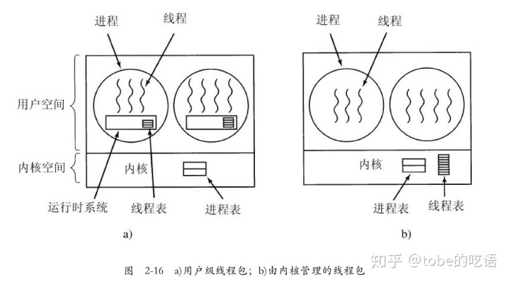
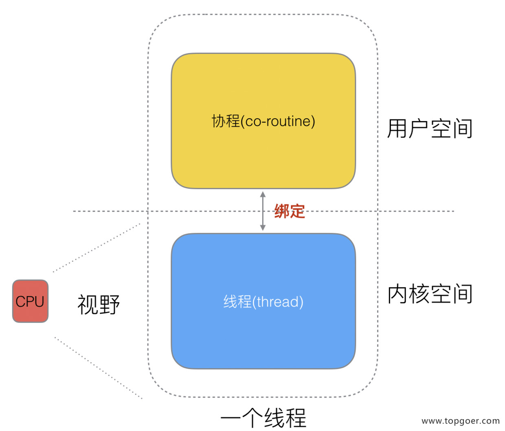
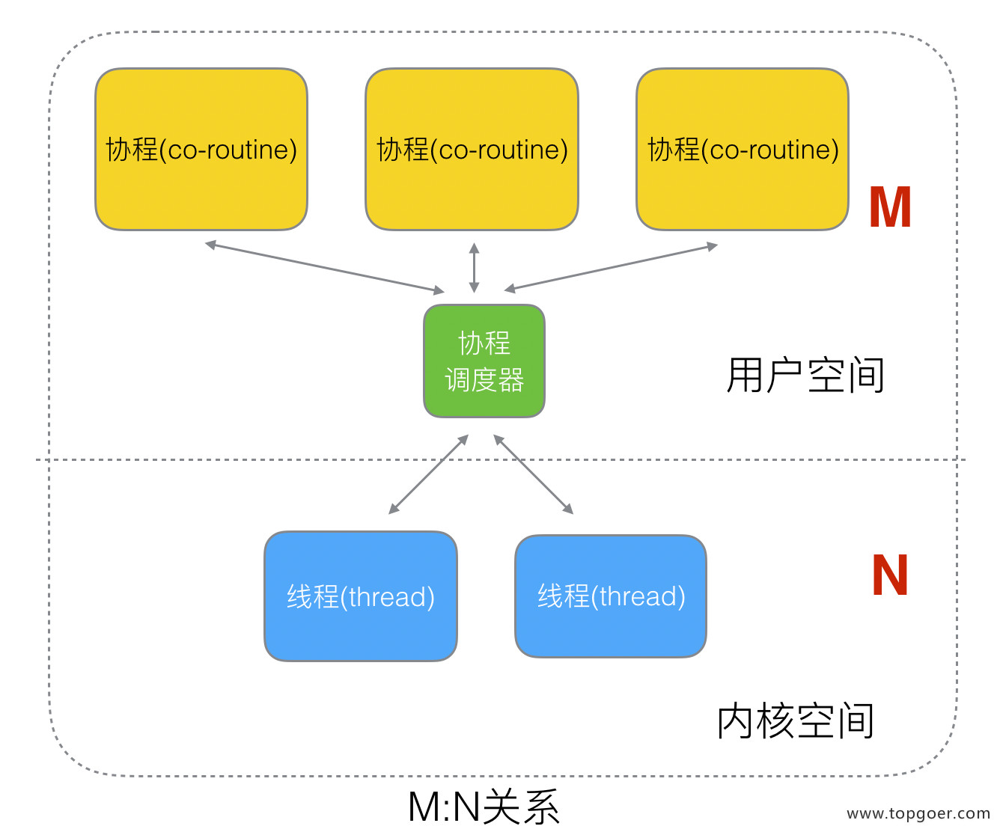

# 并发编程
`goroutine`奉行通过通信来共享内存，而不是共享内存来通信
## 进程、线程、协程
* 进程：程序在操作系统中的一次执行过程，系统进行资源分配和调度的一个独立单位。
* 线程：进程的一个执行实体，是`CPU`调度和分派的基本单位,它是比进程更小的能独立运行的基本单位。
* 协程：独立的栈空间，共享堆空间，调度由用户自己控制，本质上有点类似于用户级线程，这些用户级线程的调度也是自己实现的。
* 一个进程可以创建和撤销多个线程；同一个进程中的多个线程之间可以并发执行。
* 一个线程上可以跑多个协程，协程是轻量级的线程。
## 并发与并行
* 线程程序在一个核的`CPU`上运行，就是并发，主要通过切换时间片来实现。

* 多线程程序在多个核的`CPU`上运行，就是并行，直接利用多核实现多线程的运行。

## Goroutine
### Gooutine调度模型
见下文`GMP`原理与调度
### runtime包
* runtime.Gosched()：让出`CPU`的时间片以执行其他线程，它不会挂起当前线程，因此当前线程未来会继续执行。
* runtime.Goexit()：退出当前协程
```
func main() {
	go func() {
		defer fmt.Println("A.defer")
		func() {
			defer fmt.Println("B.defer")
			// 结束协程 则不再向下执行 只会返回去执行defer
			runtime.Goexit()
			defer fmt.Println("C.defer")
			fmt.Println("B")
		}()
		fmt.Println("A")
	}()
	for {
		// 无限循环
	}
}
B.defer
A.defer
```
* `runtime.GOMAXPROCS`：`Go`运行时的调度器使用`GOMAXPROCS`参数来确定需要使用多少个`OS`线程来同时执行`Go`代码，默认值是机器上的`CPU`核心数：`Go`语言中可以通过`runtime.GOMAXPROCS()`函数设置当前程序并发时占用的`CPU`逻辑核心数，（`Go1.5`版本之前，默认使用的是单核心执行；`Go1.5`版本之后，默认使用全部的`CPU`逻辑核心数）：
```
func a() {
	for i := 1; i < 10; i++ {
		fmt.Println("A:", i*i)
	}
}

func b() {
	for i := 1; i < 10; i++ {
		fmt.Println("B:", i*i)
	}
}

func main() {
	runtime.GOMAXPROCS(1)
	/ / 两个任务只有一个逻辑核心，此时是做完一个任务再做另一个任务，若将逻辑核心数设为2，则此时两个任务并行执行，会发现有交叉的输出。
	go a()
	go b()
	time.Sleep(time.Second)
}
```
## Channel
* 单纯地将函数并发执行是没有意义的，需要函数与函数之间交换数据才能体现并发执行函数的意义
* 创建`channel`：`channel`是引用类型，只有声明而没有初始化的`channel`是`nil` ，需要使用`make`初始化后才能够使用。
### 无缓冲`channel`
* 又称为阻塞`channel`，在无缓冲通道上的发送操作会阻塞当前`goroutine`，直到另一个`goroutine`接收值，则本次发送成功，两个`goroutine`继续执行，如果没有接收方则会造成`deadlock`，因此**发送数据前必须确保有接收方**。
```
func recvFromBlockChan(ch chan int) {
	v := <-ch
	fmt.Println("recvFromBlockChan ", v)
}

func sendToBlockChan() {
	ch := make(chan int)
	go recvFromBlockChan(ch)
	ch <- 128
	fmt.Println("SendToBlockChan ", 128)
}
```
### 有缓冲`channel`
* 在使用`make`函数初始化`channel`的时候为其指定大于`0`的容量，这就表示通道中能存放元素的数量，可以使用`len`函数获取通道内元素的数量，使用`cap`函数获取通道的容量。
* 当通过通道发送有限的数据时，我们可以通过`close`函数关闭通道来告知从该通道接收值的`goroutine`停止等待；当通道被关闭时，往该通道发送值会引发panic，从该通道里接收的值一直都是类型零值。判断一个通道被关闭一般有两种方式：
    * `if d, ok = <- ch; ok {...}`，通道在关闭后继续取值则`ok = false`
    * `for v := range ch{...}`，在通道关闭后就会自动退出循环
```
func chanIsClosed() {
	ch1 := make(chan int)
	ch2 := make(chan int)
	// 开启goroutine将0~9的数发送到ch1中 之后close ch1
	go func() {
		for i := 0; i < 10; i++ {
			ch1 <- i
		}
		close(ch1)
	}()
	// 开启goroutine从ch1中接收值，并将该值的平方发送到ch2中 之后close ch2
	go func() {
		for {
			i, ok := <-ch1 // 通道关闭后再取值ok=false
			if !ok {
				break
			}
			ch2 <- i * i
		}
		close(ch2)
	}()
	// 在主goroutine中从ch2中接收值打印
	for i := range ch2 { // 通道关闭后会退出for range循环
		fmt.Println(i)
	}
}
```
### Close(chan)
* **注意**：只有在通知接收`goroutine`所有的数据都已经完毕的时候才需要关闭通道；通道与文件不同，通道可以被垃圾回收机制回收，文件则不可以，因此在结束操作之后必须关闭文件，但不必关闭通道。
* 关闭后的通道有以下特点：
    * 对一个关闭的通道再发送值就会导致panic。
    * 对一个关闭的通道进行接收会一直获取值直到通道为空。
    * 对一个关闭的并且没有值的通道执行接收操作会得到对应类型的零值。
    * 关闭一个已经关闭的通道会导致panic
### 单向通道
* 有的时候我们会将通道作为参数在多个任务函数间传递，很多时候我们在不同的任务函数中都会限制对这个通道的使用，比如限制通道在函数中只能发送或只能接收，`Go`语言中提供了单向通道来处理这种情况：
    * `<- chan int`：表示`chan`只能向外发送数据，也就是一个只读`channel`
    * `chan<- int`：表示`chan`只能被写入数据，也就是一个只写`channel`
```
func writeToSingleChan(ch chan<- int) {
	for i := 0; i < 5; i++ {
		ch <- i
	}
	close(ch)
}

func readFromeSingleChan(ch <-chan int) {
	for v := range ch {
		fmt.Println(v)
	}
}

func singleChan() {
	runtime.GOMAXPROCS(1)
	ch := make(chan int, 10)
	go writeToSingleChan(ch)
	go readFromeSingleChan(ch)
	time.Sleep(time.Second)
}
```
## WorkerPool
* 即`goroutine`池，本质上是生产者-消费者模型，可以有效控制`goroutine`数量 **....未完待续**
## 定时器
* `Timer`：时间到了就执行，只执行`1`次
* `Ticker`：时间到了就执行，多次执行
## Select多路复用
* 在某些场景下我们需要同时从多个通道接收数据。通道在接收数据时，如果没有数据可以接收将会发生阻塞，这时就可以使用`select`
* 一次`select`只选择一个执行完通信的`case`执行，如果有多个`case`可执行，则随机选一个，执行之后本次`select`结束，即使有其他`case`也不再执行。
* 在`case`中进行`break`只能退出本`select`，而实际上`select`中其实不需要`break`，这就是说在这里`beak`其实没有意义。
## 并发安全与锁
### 互斥锁
* 互斥锁是一种常用的控制共享资源访问的方法，它能够保证同时只有一个`goroutine`访问共享资源。`Go`语言中使用`sync`包的`Mutex`类型来实现互斥锁：
```
var wg sync.WaitGroup
var lock sync.Mutex

func Add(a *int, b int) {
	for i := 0; i < 500; i++ {
		lock.Lock()
		*a += b
		lock.Unlock()
	}
	wg.Done()
}

func main() {
	var x int = 0
	wg.Add(2)
	go Add(&x, 1)
	go Add(&x, 1)
	wg.Wait()
	fmt.Println(x)
}
```
* 使用互斥锁能够保证同一时间有且只有一个`goroutine`进入临界区，其他的`goroutine`则在等待锁；当互斥锁释放后，等待的`goroutine`才可以获取锁进入临界区，多个`goroutine`同时等待一个锁时，唤醒的策略是随机的。
### 读写互斥锁
* 互斥锁是完全互斥的，但是有很多实际的场景下是读多写少的，当我们并发的去**读取一个资源而不涉及资源修改**的时候是没有必要加锁互斥的，这种场景下使用读写锁是更好的一种选择。读写锁在`Go`语言中使用`sync`包中的`RWMutex`类型。
* 读写锁分为两种：读锁和写锁。
    * 当一个`goroutine`获取读锁之后，其他的`goroutine`如果是获取读锁会继续获得锁，如果是获取写锁就会等待；当一个`goroutine`获取写锁之后，其他的`goroutine`无论是获取读锁还是写锁都会等待。
```
func Write(v *int) {
	rwlock.Lock()
	*v += 1
	rwlock.Unlock()
	wg.Done()
}

func Read(v *int) {
	rwlock.RLock()
	fmt.Println(*v)
	rwlock.RUnlock()
	wg.Done()
}

func RWMutexTest() {
	start := time.Now()
	var v int = 0
	for i := 0; i < 10; i++ {
		wg.Add(1)
		go Write(&v)
	}
	for i := 0; i < 1000; i++ {
		wg.Add(1)
		go Read(&v)
	}
	wg.Wait()
	end := time.Now()
	fmt.Println("time := ", end.Sub(start).Milliseconds())
}
```
## Sync
* `(wg *WaitGroup) Add(delta int)`	计数器+`delta`
* `(wg *WaitGroup) Done()` 计数器`-1`
* `(wg *WaitGroup) Wait()`	阻塞直到计数器变为`0`
*  `sync.WaitGroup`内部维护着一个计数器，计数器的值可以增加和减少。例如当我们启动了`N`个并发任务时，就将计数器值增加`N`。每个任务完成时通过调用`Done()`方法将计数器减`1`。通过调用`Wait()`来等待并发任务执行完，当计数器值为`0`时，表示所有并发任务已经完成。
* `sync.Once`：在很多场景下我们需要确保某些操作在高并发的场景下只执行一次，例如只加载一次配置文件、只关闭一次通道等。`Go`语言中的`sync`包中提供了一个针对这种场景的解决方案`sync.Once`，其中只有一个`Do`方法，其签名如下：`func (o *Once) Do(f func()) {}`，**注意：如果要执行的函数f需要传递参数就需要搭配闭包来使用**
```
var icons map[string]image.Image

var loadIconsOnce sync.Once

func loadIcons() {
    icons = map[string]image.Image{
        "left":  loadIcon("left.png"),
        "up":    loadIcon("up.png"),
        "right": loadIcon("right.png"),
        "down":  loadIcon("down.png"),
    }
}

// Icon 是并发安全的
func Icon(name string) image.Image {
    loadIconsOnce.Do(loadIcons)
    return icons[name]
}
```
* `sync.Map`：`Go`语言内置的`map`不是并发安全的，`sync`包中提供了一个开箱即用的并发安全版`map`——`sync.Map`：它不用像内置的`map`一样使用`make`函数初始化就能直接使用；同时`sync.Map`内置了诸如`Store、Load、LoadOrStore、Delete、Range`等操作方法
## 原子操作
* 所谓原子操作是指不会被线程调度机制打断的操作；这种操作一旦开始，就一直运行到结束，中间不会有任何`context switch`
* 代码中的加锁操作因为涉及内核态的上下文切换会比较耗时、代价比较高：因此**针对基本数据类型**我们还可以使用原子操作来保证并发安全，因为原子操作是`Go`语言提供的方法它在用户态就可以完成，因此性能比加锁操作更好。`Go`语言中原子操作由内置的标准库`sync/atomic`提供。
## GMP原理与调度
### “用户态”线程与“内核态”线程：
* **用户态线程：** 即使用用户级线程库创建的线程库，可以自制定调度算法，这样的线程对`os`透明，即在`os`那里注册的只有进程，而无用户态线程，如果这样的线程被阻塞，则`os`认为该进程被阻塞。
* **内核态线程**： `os`支持通过系统调用创建新的内核态线程，这个线程会被注册到`os`空间里（表格/堆栈里），则`os`可以像调度进程一样将这些线程放在不同的核上运行，而且某个线程的阻塞不会影响其它线程的正常运行，但是我们的程序执行在用户态，所以让内核来进行线程的切换就必须每次陷入内核态，增加额外的开销，而且内核态的线程数量一般是有限制的，扩展性比不上用户态线程。
    
* **一个“用户态”线程必须绑定一个“内核态线程”**：

* 这样子，协程与内核态线程就有`3`种映射关系：
    * `N:1`：`N `个协程绑定`1`个线程：
        * 优点：协程在用户态下即可完成切换，不会陷入到内核态，这种切换非常的轻量快速；
        * 缺点：一个进程的所有协程都绑定在`1`个内核态线程上，既无法使用多核加速能力，而且一旦某个正在运行的协程被阻塞，则将导致整个线程阻塞，于是其它协程都将无法执行。
    * `1:1`：`1`个协程绑定`1`个线程，这种方式易于实现，但协程的调度就是线程的调度，全由`CPU`完成了，则协程创建、销毁、调度都等于线程的创建、销毁、调度，代价太高
    * `M:N`：`M`个协程绑定在`N`个线程上：

*  协程跟线程是有区别的，线程由`CPU`调度，是抢占式的，协程由用户态调度，是协作式的，一个协程让出`CPU`后，才执行下一个协程。
### Go的GoRoutine
见[GMP](https://www.topgoer.com/%E5%B9%B6%E5%8F%91%E7%BC%96%E7%A8%8B/GMP%E5%8E%9F%E7%90%86%E4%B8%8E%E8%B0%83%E5%BA%A6.html)