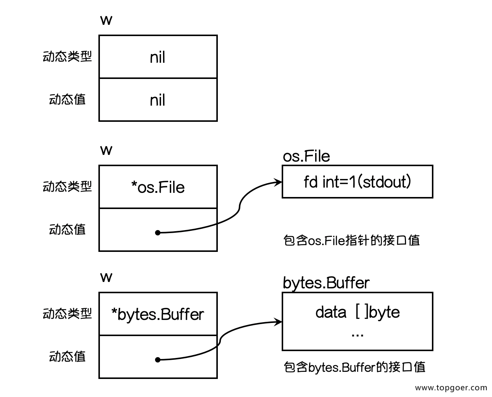

`@authon:aslanwang`
`@time:2022-3-7`
# Go-Details
## go mod 引用包
* [引入本地包](https://zhuanlan.zhihu.com/p/109828249)
## Method
### 定义
* `func (recevier type) methodName(参数列表)(返回值列表){}`
* `Method`的特点：
    * `receiver`的类型`type`可以是`T`或`*T`；基类型`T`不能是接口或指针。
    * 不论`type`是`T`还是`T*`，都可以用实例`value`或其`pointer` 调用全部方法，这一点由编译器自动转换所保障，即`value`调用`receiver T*`时会被转换成`&value`去调用（**前提是value可以被寻址，是一个左值）**
    * 当`type`为`T*`时，，即使是用值调用方法，函数内部也是对指针的操作。
    * 当`type`为`T`时，该方法操作的对应`receiver`的值的副本，也就是即使是用指针调用方法，函数内部操作也还是对副本的操作，而不是指针操作。
### 方法集
* 类型`T`方法集包含全部`receiver T`方法。
* 类型`*T`方法集包含全部 `receiver T + *T`方法。
    * **前文已经解释过这一点，如果T类型的value是右值，如func的返回值，则不可以被寻址，无法被编译成转换为&value，就无法调用\*T的方法，因此T的方法集是包括receiver T**
* 如类型`S`包含匿名字段`T`，则`S`方法集包含`T`方法；如类型`S`包含匿名字段`*T`，则`S`方法集包含`T+*T`方法。
* 如类型`S`包含匿名字段`T/*T`，`*S`的方法集都包括`T+*T`方法
[Method-Set](https://stackoverflow.com/questions/33587227/method-sets-pointer-vs-value-receiver)
### method表达式
*`method`表达式分两种：
    * `m1 := instance.method(args...)`
    * `m2 := (type).func(instance, args...)`
* `m1`称为`method Value`，而且`m1`会立即复制`instance`，它就直接与实例绑定了
*`m2`则需要显式传递实例的指针才能调用
```
type User struct {
    id   int
    name string
}

func (self User) Test() {
    fmt.Println(self)
}

func main() {
    u := User{1, "Tom"}
    mValue := u.Test // 立即复制 receiver，因为不是指针类型，不受后续修改影响。
    u.id, u.name = 2, "Jack"
    u.Test()
    mValue()
    
   mExpression := (*User).Test
   mExpression(&u) // 显式传递 receiver
}
```
## 匿名字段
* `go`支持在结构体中包括**只有类型，而无名称**的字段，称为匿名字段/嵌入字段
*`type A struct... `，接下来在结构体`B`中定义匿名字段`A`：
    * 则使用`B`可以直接访问`A`的`method`，这种查找由编译器负责，类似于”继承“：
    * 同时`A, B`可定义同名的`method`，类似于`OverRide`，这时可以用`B.A.method()`调用`A`中的方法
    * 如果`A`中定义了字段`f1`，`B`中也另外定义了字段`f1`，则`B.f1`与`B.A.f1`分别访问的是`B`，`A`中定义的`f1`
```
type Person struct {
	age  int // 年龄
	name string
}

type Student struct {
	Person // 匿名字段Person
	sno    uint64
	age    int // 学年
}

func (p *Person) PrintInfo() {
	fmt.Printf("%v", p)
}

func (p *Person) HelloPerson() {
	fmt.Println("Hello ", p.name)
}

func (s *Student) PrintInfo() {
	s.Person.PrintInfo()        // 通过s.Person调用Printinfo
	fmt.Printf("%v\n", s.sno)
}

func testAnonymousField() {
	var s *Student = new(Student)
	s.age = 4
	s.Person.age = 18
	s.name = "张三"
	s.sno = 201813042
	s.PrintInfo()
	s.HelloPerson()        // 直接用s调用Person的方法
}
```
## `interface`
* 详解见[interface详解](https://studygolang.com/articles/14465)
* 在`Go`语言中接口（`interface`）是一种类型，一种抽象的类型：给出一个接口类型的值时，我们不能知道它是什么，但可以知道通过它的方法能做什么。
* 接口也可实现类似OOP中的多态，其命名习惯以 er 结尾。
* 接口是一个或多个方法签名的集合，而且只有方法的声明，没有实现，也没有任何数据字段。
```
type 接口类型名 interface{
    方法名1( 参数列表1 ) 返回值列表1
    方法名2( 参数列表2 ) 返回值列表2
    …
}
```
* 任何类型的方法集中只要拥有该接口'对应的全部方法'签名，就表示它 "实现" 了该接口，无须在该类型上显式声明实现了哪个接口：这意味着接口就是一个需要实现的方法集。
    * 一个类型可实现多个接口。
    * 接口同样支持匿名字段方法，这意味着实现接口不必完全仅靠一个类型来实现，也可以在`A`类型中设置匿名字段`B`类型，`A, B`各自实现接口的一部分方法。
    * 接口可以匿名嵌入其他接口或结构中，从而创造出新的接口，嵌套得到的接口的使用与普通接口一样，还是只需要实现相应的方法集，就可以实现该接口
```
// Sayer 接口
type Sayer interface {
    say()
}
// 定义dog和cat两个结构体：

type dog struct {}

type cat struct {}
// 因为Sayer接口里只有一个say方法，所以我们只需要给dog和cat 分别实现say方法就可以实现Sayer接口了。

// dog实现了Sayer接口
func (d dog) say() {
    fmt.Println("汪汪汪")
}

// cat实现了Sayer接口
func (c cat) say() {
    fmt.Println("喵喵喵")
}
```


* 把一个对象赋值给接口时，会发生拷贝，而接口内则存储的是指向这个复制品的指针，既无法修改复制品的状态，也无法获取指针。
* 只有当接口存储的类型和对象都为nil时，接口才等于nil：接口值是由一个具体类型和对应的值两部分组成的，这两部分分别称为接口的动态类型和动态值。
* 接口类型变量能够存储所有实现了该接口的实例。如上面的示例：
```
func main() {
    var x Sayer // 声明一个Sayer类型的变量x
    a := cat{}  // 实例化一个cat
    b := dog{}  // 实例化一个dog
    x = a       // 可以把cat实例直接赋值给x
    x.say()     // 喵喵喵
    x = b       // 可以把dog实例直接赋值给x
    x.say()     // 汪汪汪
}
```
### 关于`interface`与`receiver`
* 接口调用不会做`receiver`的自动转换。
* 值接收者实现接口，不管是`value`结构体还是结构体指针类型的变量都可以赋值给该接口变量。因为`Go`语言中有对指针类型变量求值的语法糖；而指针`receiver`实现接口，则只能将结构体指针类型的变量赋值给该接口。
### 空接口
* 空接口是指没有定义任何方法的接口，因此任何类型都实现了空接口空接口，于是空接口可以作为任何类型数据的容器
* 作为函数参数来接受任意类型的实参：
 ```
 // 空接口作为函数参数
func show(a interface{}) {
    fmt.Printf("type:%T value:%v\n", a, a)
}
 ```
* 空接口作为`map`的值，实现可以保存任意值的字典
```
// 空接口作为map值
var studentInfo = make(map[string]interface{})
studentInfo["name"] = "李白"
studentInfo["age"] = 18
studentInfo["married"] = false
fmt.Println(studentInfo)
```
* 类型断言：空接口可以存储任意类型的值，要获取其存储的值就需要使用类型断言：`x.(T)`

