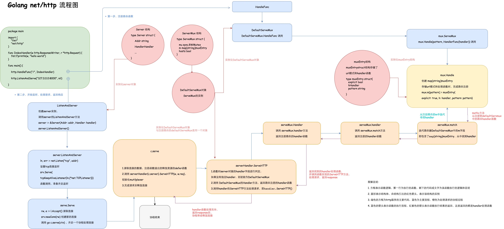

# Web开发
## TCP编程
* 传输控制协议，是一种面向连接的、可靠的、基于字节流的传输层通信协议。
### TCP粘包
* 应用层发送的消息进入传输层时，会被**切割**成长度为`MSS`的数据包，`MSS`限制了`TCP`提交给网络层的最大分段大小；而网络层向链路层传输数据的大小被限制为`MTU`，因此大于`MTU`的数据会被分片

* `TCP`的`Nagle`算法优化，可以避免发送小的数据包：
    * 如果包长度达到`MSS`（或含有`Fin`包），立刻发送，否则等待下一个包到来；
    * 如果下一包到来后两个包的总长度超过`MSS`的话，就会进行拆分发送；
    * 等待超时（一般为`200ms`），第一个包没到`MSS`长度，但是又迟迟等不到第二个包的到来，则立即发送
* `TCP`是基于**字节流**的，因此应用层发送给传输层`TCP`的数据，不是以消息报为单位向目的主机发送，而是以字节流的方式发送到下游，这些数据就有可能被**切割和组装**成各种数据包，接收端收到这些数据包后没有进行正确还原，因此出现粘包现象；如果接收端的应用层没有及时读取`TCP`的`Recv Buffer`中的数据，也有可能发生粘包：
    * 粘包出现的根本原因是不确定消息的边界，而这并不是`TCP`的问题，只需要发送端在发送消息的时候**带上足够识别边界的信息**即可避免粘包，如：


* 如对消息进行封包：就是给一段数据加上包头，这样一来数据包就分为包头和包体两部分内容了，包头部分的长度是固定的，并且它存储了包体的长度，根据包头长度固定以及包头中含有包体长度的变量就能正确的拆分出一个完整的数据包：
```
func Encode(message string) ([]byte, error) {
	var length = int32(len(message))
	pkg := new(bytes.Buffer)
	if err := binary.Write(pkg, binary.LittleEndian, length); err != nil {
		return nil, err
	}
	if err := binary.Write(pkg, binary.LittleEndian, []byte(message)); err != nil {
		return nil, err
	}
	return pkg.Bytes(), nil
}

func Decode(reader *bufio.Reader) ([]byte, error) {
	var length int32
	if err := binary.Read(reader, binary.LittleEndian, &length); err != nil {
		return nil, err
	}
	data := make([]byte, length)
	if _, err := reader.Read(data); err != nil {
		return nil, err
	}
	return data, nil
}
```

* `UDP`则不会出现粘包，它是面向无连接，不可靠的，基于**数据报**的传输层通信协议。
## HTTP编程
* `Go`的`net/http`库处理流程：详解见[net/http详解](https://www.jianshu.com/p/be3d9cdc680b)
